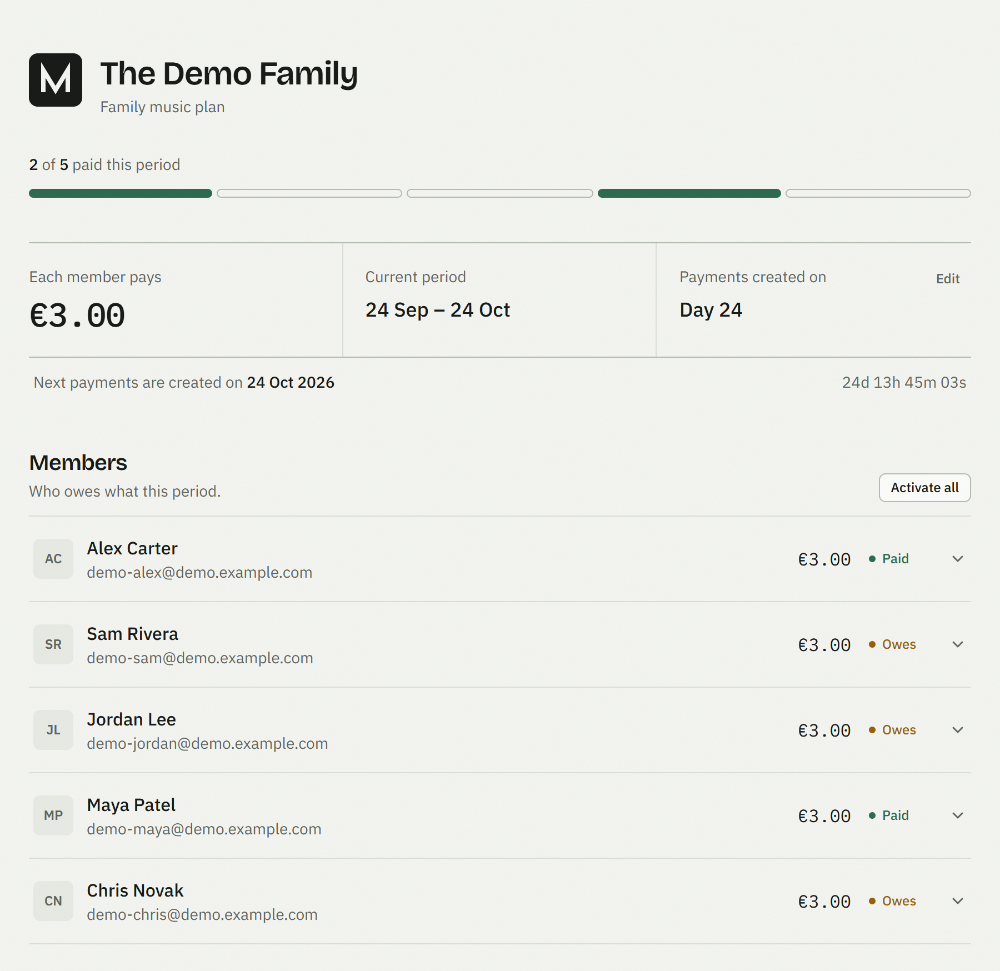
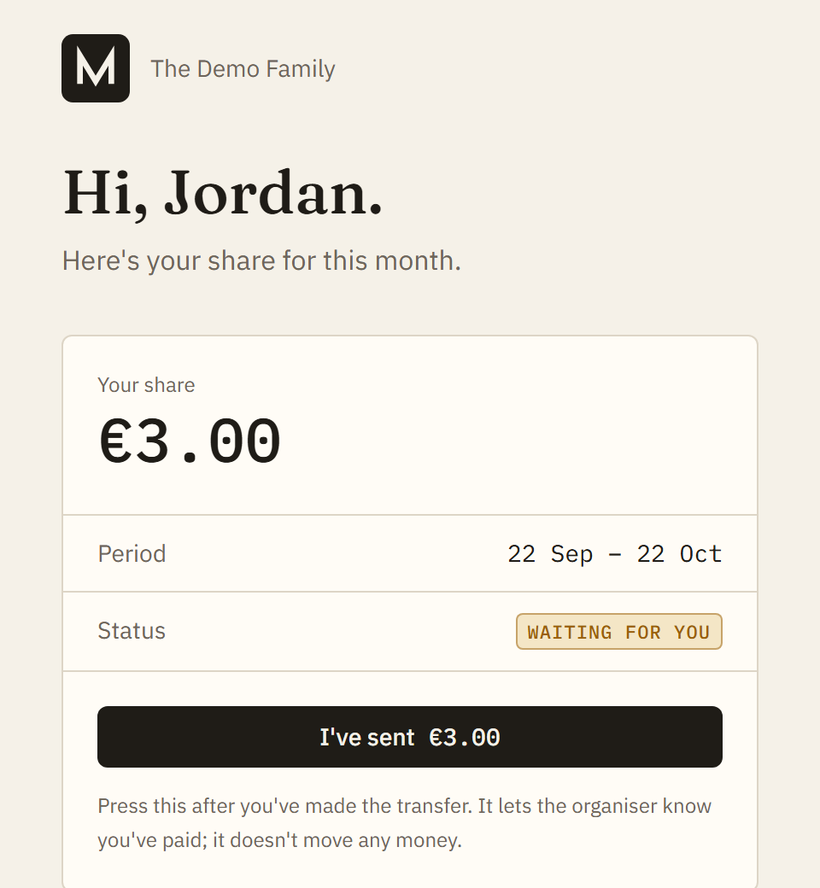

# Merio

[](https://github.com/nikoletaxvs/merio/actions/workflows/ci.yml)

Merio keeps track of who has paid their share of a family subscription. Each
member gets a monthly payment, a personal link to mark it paid, and reminder
emails until they do.

**Demo:** [Merio Demo](https://merio-demo.vercel.app) (sample data,
resets nightly, no emails sent)

<!--
  TODO: replace the demo link with the permanent domain from the demo Vercel
  project (Settings → Domains), e.g. https://merio-demo.vercel.app/demo.
  The current per-deployment URL asks visitors to log in to Vercel.
-->

<p>
  
  
</p>

## Why I built it
Me and my friend group share a spotify family plan, every month the admin user had to remind everyone to pay. Its not a tiring task but I personally believe that having many small tasks in the background is cognitively exhausting and anxiety inducing. So there I spotted an opportunity to make our lives easier and automate this montly process.

## How it works

The owner adds members and sets the monthly amount. A daily job creates each
member's payment when a new period starts, and another emails anyone who
hasn't paid on day 1, day 7 and then weekly. Members open their link, see what
they owe and their history, and press a button once they've sent the money.
Merio only tracks payments; the money itself moves however the family already
pays each other.

## Decisions worth mentioning
1. Authentication is purposefully omitted for members and a token per user is used instead for better UX since the nature and scale of the app allow that
2. The demo is a separate deployment and requires no password for login

## Stack

Next.js 16 (App Router, server actions), React 19, TypeScript, Tailwind CSS 4,
Postgres with Drizzle, Nodemailer over Gmail, Vitest, deployed on Vercel with
Vercel Cron.

## Running it locally

```bash
npm install
cp .env.example .env   # fill in DATABASE_URL, AUTH_SECRET, ...
npx drizzle-kit migrate
npm run dev
```

Set `DEMO_MODE=true` in `.env` (with a throwaway database) to skip the password
and get sample data.

Environment variables, the database schema, how billing and auth work, and how
the demo is deployed are in [docs/DEVELOPMENT.md](docs/DEVELOPMENT.md).

## Limitations

One owner per deployment, and members mark themselves as paid; Merio trusts
them. Both are fine for a family, and both would need to change before this
could serve strangers.
